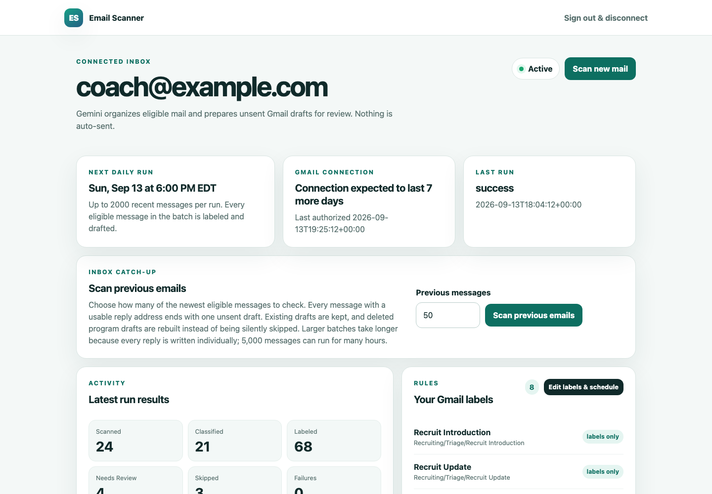
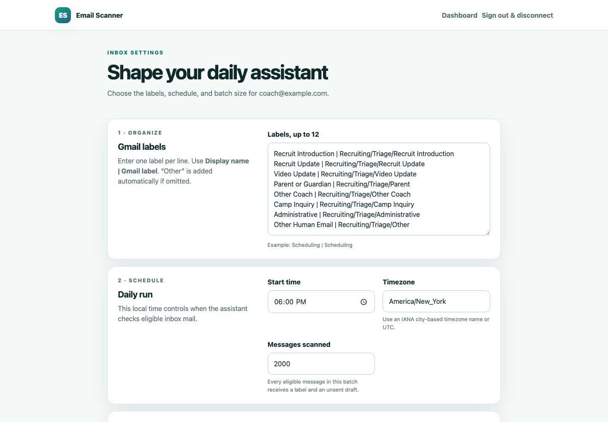
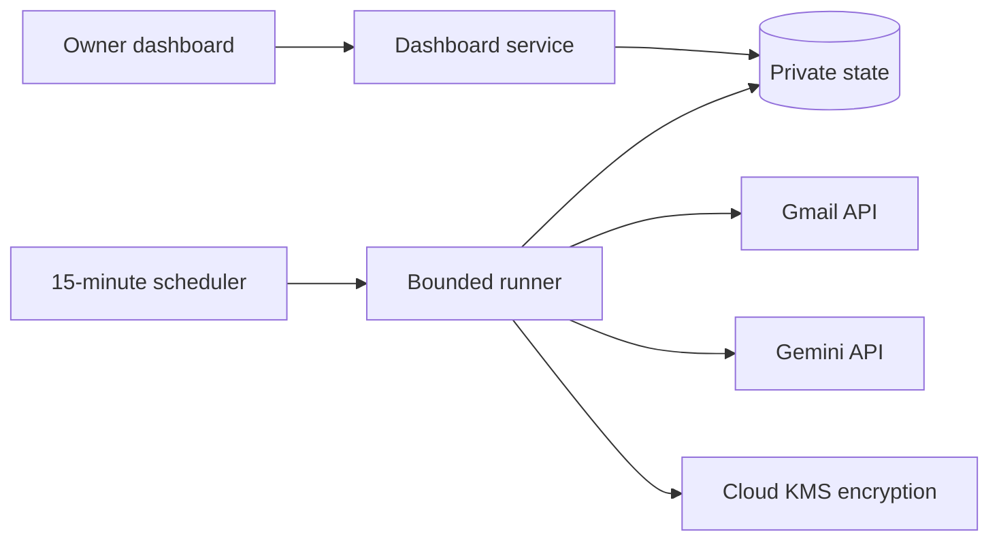

# Email Drafting Tool

[](https://github.com/Kirolosir/Email-Scanner/actions/workflows/tests.yml)

[Live application](https://email-scanner.136-116-196-15.nip.io/login)

This is a Python tool for sorting a Gmail inbox and saving reply drafts. It
never sends mail. The person using the account opens each draft in Gmail and
decides whether to edit, send, or delete it.

The project combines a small Python web dashboard, Google OAuth, the Gmail API,
scheduled background work, and Gemini-powered classification and reply
generation.





_Screenshots use synthetic account and run data._

## Engineering highlights

- Account-bound Google OAuth with one connected Gmail account at a time.
- Envelope-encrypted credentials and backups backed by Cloud KMS.
- Idempotent message and draft journals that make interrupted runs safe to
  resume.
- Bounded retry queues for transient Gmail and generation failures.
- PII-free operational status, structured coverage reports, and usage metrics.
- A tested no-send boundary: the application can label mail and create drafts,
  but production code contains no Gmail send operation.

## Architecture



## What it does

The project has two workflows.

`campaign.py` handles a one-time message sent to a known group, such as a
clinic announcement. It reads an existing Gmail label, groups messages by
sender address, and uses the newest thread for each person. This prevents ten
emails from the same recruit from producing ten copies of the same draft.

A protected campaign cannot create drafts from an unreviewed list. The tool
first produces the recipient list for inspection. A separate approval file
records the Gmail account, label, and addresses that were approved. Every
created draft ID is written to a private log. If the run needs to be undone,
the rollback command moves only those drafts to Trash.

`triage.py` and `daily_triage.py` handle regular inbox mail. The first run can
look back about two months. Later runs use a three-day overlap and a local
journal so delayed mail is still found without creating another draft for a
message that was already handled. Scheduled runs require explicit scan, write,
and draft caps and can produce a private, content-free review report.

The hosted dashboard turns those internal caps into one message batch size and
reserves enough writes and drafts to finish every eligible message in the
batch. **Scan new mail** checks the recent overlap window. **Scan previous
emails** accepts a number from 1 to 5,000 and checks that many of the newest
eligible messages without an age cutoff. Large history jobs are applied in
restart-safe groups of 50, so completed work is saved continuously and never
duplicated.

The dashboard shows live analysis and drafting progress, keeps failed runs
visible until they are resolved, and provides a review queue with direct links
to Gmail drafts. A coach profile stores the owner's role, program, signature,
and voice guidance. For recruiting messages, the classifier also extracts the
stated recruit name, graduation year, position, school or club, and location.
The dashboard marks these details as model-extracted so the coach verifies them
against the original email before sending.

Each completed run also publishes a content-free reliability summary. It
separates created, preserved, and rebuilt drafts from messages without a safe
reply address and from retrieval or generation failures. Temporary failures
enter a private, bounded retry queue; the existing 15-minute scheduler resumes
only the due messages, so a large history job does not need to start over.
Configuration and bounded run history are encrypted with the deployment key,
written to rotating backups, decrypted immediately for an integrity check, and
covered by an offline restore test. The dashboard reports Gmail requests and
retries, quota units, model calls and tokens, estimated standard paid-tier
cost, run time, average run time, queue depth, and backup health.

Triage assigns messages to categories configured for that account, then adds
the matching Gmail labels. Existing labels are left alone. A one-time,
account-bound activation can enable an unsent generated draft for every message
with a safe, unambiguous reply address. The current account-wide policy includes
mailing-list, bulk-precedence, and auto-submitted messages when they still have
a safe reply address. Spam, trash, sent mail, existing drafts, bounce/no-reply
targets, self-replies, missing or ambiguous addresses, and malformed reply
metadata never get a new draft. Uncertain messages receive the configured Other
and Needs Review labels plus a neutral acknowledgement draft.

For account-wide runs, saved completion state is checked against the drafts
that currently exist in Gmail. If a program-created draft was deleted, the
message becomes eligible again and the missing draft is rebuilt. Hosted label
defaults use ordinary Gmail names such as `Finance`, `Other`, `Needs Review`,
and `Processed`; they do not add a machine-specific prefix.

The activation is off by default and tied to a digest of the account settings.
The account owner must type the full confirmation; `--yes` cannot create it.
Every generated reply remains in Gmail Drafts for the owner to review, edit,
send manually, or discard. Failed or rejected generation is retried once, then
replaced with a fact-free acknowledgement. Older
category-specific and fixed-template approvals remain supported for migration.

Recruiting-year labels have their own check. A classification alone cannot add
one. The sender must be a recruit, the category must be relevant, confidence
must be high, and the current message must contain matching year evidence.
Quoted replies, signatures, dates, telephone numbers, and unrelated numbers do
not count. The same rule applies whether or not a reply draft is created.

Google's `gmail.modify` scope technically permits sending email, but this tool
does not send. That boundary is enforced through application code and tests,
not through the OAuth permission itself.

## Offline tests

Create the virtual environment and install the dependencies described in the
detailed guide. From the project directory, run:

```sh
.venv/bin/python -m pytest -q
```

The test suite is offline and uses synthetic messages, fake Gmail objects, and
stub classifiers. It does not connect to Gmail, Gemini, OAuth, or the hosted
authorization service. The suite checks the no-send rule, add-only labels,
approval binding, recruiting-year evidence, duplicate prevention, rollback behavior,
and the hosted authorization code. A passing test run checks the local code;
it does not grant access to a Gmail account.

Full setup, safety architecture, and rollout details: see [DETAILS.md](DETAILS.md).
