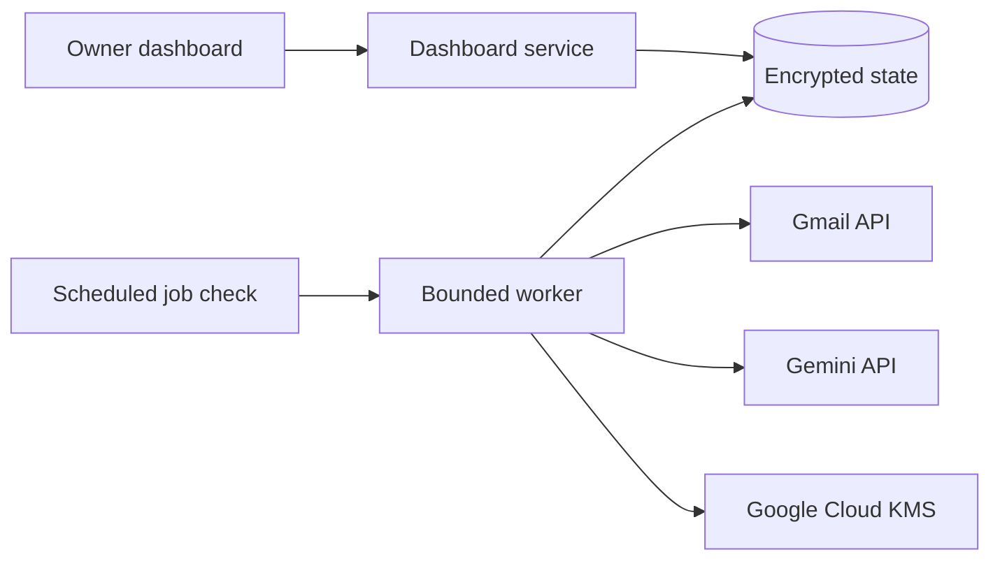

# Email Triage & Drafting Platform

[](https://github.com/Kirolosir/Email-Scanner/actions/workflows/tests.yml)

[Live application](https://email-scanner.136-116-196-15.nip.io/login)

A production-deployed Gmail triage and drafting system built for a high-volume recruiting inbox. The platform classifies incoming mail, applies Gmail labels, prepares reply drafts, and leaves every message for human review before anything is sent.

The system is designed around a strict no-send boundary: it can read, label, and draft, but production code contains no Gmail send operation.


_Screenshots use synthetic account and run data._

## Stack

Python, Gmail API, Gemini API, Google OAuth 2.0, Google Cloud KMS, pytest

## Engineering highlights

- Processes a 9,000+ message recruiting inbox while keeping final communication under human control.
- Uses account-bound OAuth so credentials and approvals cannot be reused across Gmail accounts.
- Encrypts stored credentials and rotating backups with Google Cloud KMS.
- Uses idempotent message and draft journals to prevent duplicate work across interrupted or repeated runs.
- Supports resumable background jobs, bounded retries, and per-message failure isolation for large inbox scans.
- Runs daily scans from a server timer, so the dashboard and browser do not need to remain open.
- Can reuse exact existing Gmail labels without creating new ones, or create only explicitly reviewed missing labels.
- Reconciles saved processing state with Gmail so deleted program-created drafts can be safely rebuilt.
- Provides guarded rollback that removes only the drafts and label changes created by the selected run.
- Publishes content-free reliability and usage metrics without exposing message bodies or personal data.
- Enforces the no-send rule through both application structure and automated tests.

## Architecture



## Core workflows

### Inbox triage

The triage pipeline scans eligible Gmail messages, classifies them into account-configured categories, applies the matching labels, and prepares drafts for messages with a safe reply address.

Recent-mail scans use an overlap window plus a local completion journal so delayed messages are still found without drafting the same message twice. Larger scans run as resumable jobs and continue from saved progress instead of restarting the entire inbox.

Messages with unsafe or ambiguous reply metadata are not drafted. Spam, trash, sent mail, existing drafts, bounce addresses, self-replies, and malformed reply targets are excluded from draft creation.

### Recruiting metadata

For recruiting messages, the classifier can extract the stated recruit name, graduation year, position, school or club, and location. These values are displayed for review rather than treated as verified facts.

Graduation-year labels require both a high-confidence recruiting classification and matching year evidence in the current message. Quoted replies, signatures, phone numbers, dates, and unrelated numbers do not qualify.

### Campaign drafting

The campaign workflow prepares one draft per recipient from an approved Gmail label. Messages are grouped by sender and the newest thread is used, preventing repeated conversations with the same person from creating duplicate campaign drafts.

Campaign runs require an inspected recipient list and account-bound approval before drafts can be created. Every created draft is journaled so the run can be rolled back precisely.

## Reliability and safety

The worker uses bounded retry queues for temporary Gmail or generation failures. Each message is isolated so one bad message does not stop the rest of the run.

Configuration and run history are encrypted, written to rotating backups, and checked after backup creation. The dashboard reports request counts, retries, quota usage, model usage, queue depth, run timing, and backup health without exposing message content.

Google's Gmail modify scope technically permits sending mail, but this application never calls the send endpoint. Draft review and sending remain manual actions inside Gmail.

## Testing

```bash
.venv/bin/python -m pytest -q
```

The test suite runs offline with synthetic messages, fake Gmail objects, and stubbed classifiers. Coverage includes:

- no-send enforcement
- duplicate prevention
- approval binding
- rollback behavior
- recruiting-year evidence rules
- retry and recovery paths
- hosted authorization behavior

Full setup and implementation details are in [DETAILS.md](DETAILS.md).
